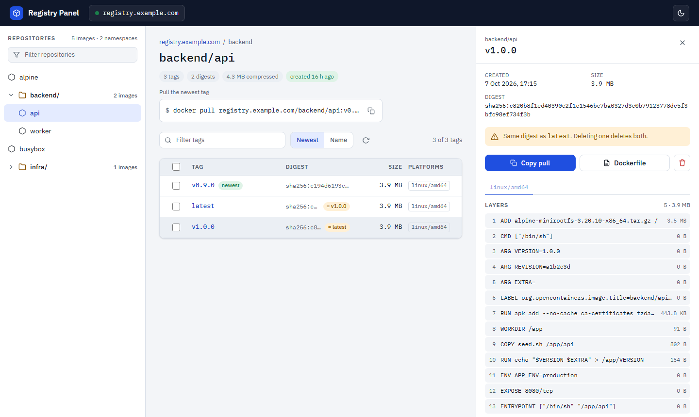

<h1 align="center">Docker Registry Panel</h1>

<p align="center">
  A fast, single-page web panel for private Docker / OCI registries.<br>
  Browse repositories and tags, inspect manifests and layers, see shared digests, delete safely.
</p>

<p align="center">
  <a href="https://hub.docker.com/r/dipstech/docker-registry-panel"></a>
  
  
</p>

<picture>
  <source media="(prefers-color-scheme: dark)" srcset="docs/images/screenshot-dark.png">
  
</picture>

## Why

Most registry UIs are static pages that call the registry API straight from the browser. That
means CORS headaches, credentials in the browser, and every user re-downloading every manifest.

Docker Registry Panel puts a small backend in front of the registry:

```
browser ──► panel (/api/*) ──► registry (/v2/*)
              └─ credentials, cache, aggregation
```

The browser never talks to the registry, so there is no CORS to configure, the registry credentials
stay on the server, and manifests are fetched once and cached by digest.

## Features

- **One page, three columns.** Repository tree, tag table and tag details side by side. Expanding a
  namespace or opening a tag never loses your place. Each column scrolls on its own.
- **Shareable URLs.** `/?image=backend/api&tag=v2.6.0` opens that image and tag; the back button works.
- **Tag table** with size, platforms, build date, natural version sorting, filter and a `newest` badge.
- **Shared digests made visible.** Tags that point at the same manifest are flagged (`= latest`)
  before you delete anything.
- **Safe deletion.** Multi-select, one confirmation that lists every tag that will disappear, and one
  `DELETE` per unique digest. Delete buttons only exist when you enable them.
- **Tag details:** full digest, per-platform tabs for multi-arch images, numbered layers with their
  command and size, OCI labels, entrypoint/cmd/env/ports, and a Dockerfile reconstructed from the history.
- **Resilient.** A tag whose manifest the registry can no longer serve (typical after a garbage
  collection) is shown and flagged instead of breaking the whole table.
- **Light and dark theme**, following the OS by default. Fonts are bundled, nothing is loaded from
  third-party CDNs.
- Basic auth and Bearer token registries supported; Docker v2 and OCI manifests, manifest lists and
  OCI indexes (attestation manifests are hidden).

## Quick start

```sh
docker run -d --name registry-panel -p 8080:3000 \
  -e REGISTRY_URL=https://registry.example.com \
  -e REGISTRY_USERNAME=admin \
  -e REGISTRY_PASSWORD=secret \
  -e DELETE_IMAGES=true \
  dipstech/docker-registry-panel:latest
```

Then open <http://localhost:8080>.

With docker compose, see [`docker-compose.example.yml`](docker-compose.example.yml):

```yaml
services:
  registry-panel:
    image: dipstech/docker-registry-panel:latest
    restart: unless-stopped
    environment:
      REGISTRY_URL: https://registry.example.com
      REGISTRY_USERNAME: ${REGISTRY_USERNAME}
      REGISTRY_PASSWORD: ${REGISTRY_PASSWORD}
      DELETE_IMAGES: "true"
    ports:
      - "8080:3000"
```

## Configuration

All settings are environment variables, read when the container starts.

| Variable | Default | Description |
|---|---|---|
| `REGISTRY_URL` | **required** | Registry base URL, e.g. `https://registry.example.com` |
| `REGISTRY_USERNAME` | | Username the panel uses towards the registry |
| `REGISTRY_PASSWORD` | | Password the panel uses towards the registry |
| `REGISTRY_TITLE` | host of `REGISTRY_URL` | Name shown in the top bar |
| `PULL_URL` | host of `REGISTRY_URL` | Prefix of the `docker pull` commands |
| `DELETE_IMAGES` | `false` | Show delete actions. The registry needs `REGISTRY_STORAGE_DELETE_ENABLED=true` |
| `SHOW_TAG_COUNT` | `false` | Tag count per repository in the sidebar (one registry call per repository) |
| `CATALOG_MIN_BRANCHES` | `1` | Minimum images a namespace needs to become a folder in the sidebar |
| `CATALOG_MAX_BRANCHES` | `1` | How many `/` levels become nested folders |
| `CACHE_TTL_SECONDS` | `60` | Cache lifetime of the catalog and of each tag list. Manifests are cached by digest |
| `THEME` | `auto` | `auto`, `light` or `dark`. A user's own toggle wins |
| `PORT` | `3000` | Listening port inside the container |

The panel itself has no login. Run it on an internal network or behind a reverse proxy that handles
authentication.

## Things worth knowing

- **"Created" is the build date.** The registry API does not record when a tag was pushed. The panel
  shows the image's `created` date from its config and never calls it a push date.
- **The registry deletes by digest, not by tag.** Deleting a tag removes the manifest, and every other
  tag pointing at it goes too. The panel shows this before you confirm.
- **Deleting does not free disk space** until you run garbage collection on the registry:
  `docker exec <registry> registry garbage-collect /etc/docker/registry/config.yml`.
- **Repositories with no tags left** stay in the catalog: the registry API has no way to remove them.

## API

The panel's backend exposes a small JSON API, which the frontend uses and you can script against.

| Method and path | Returns |
|---|---|
| `GET /api/registry/health` | Registry reachability and the public configuration |
| `GET /api/repositories` | `{ repositories: [{ name, tagCount? }] }`. `?refresh=1` bypasses the cache |
| `GET /api/repositories/<name>/tags` | Tag rows `{ tag, digest, size, platforms, created }`, total compressed size, unique digests |
| `GET /api/repositories/<name>/tags/<tag>` | The row plus per-platform layers, labels, config, Dockerfile and `sharedWith` |
| `DELETE /api/repositories/<name>/manifests/<digest>` | `{ deleted: true, tags: [...] }` |

## Development

```
gui/              Nuxt 3 app (SPA) and Nitro API, with the Dockerfile
dev/registry/     local registry:2 and a seed script for development
docs/             design notes (Italian) and the original interactive mockup
```

Requirements: Node.js 22+, Docker.

```sh
# a local registry with sample images, including shared digests and a multi-arch index
docker compose -f dev/registry/docker-compose.yml up -d
sh dev/registry/seed.sh

cd gui
npm install
cp .env.example .env     # REGISTRY_URL=http://localhost:5500
npm run dev              # http://localhost:3000
```

Checks:

```sh
npm run lint
npm run typecheck
npm test                                            # unit tests
TEST_REGISTRY_URL=http://localhost:5500 npm test    # plus integration tests on the local registry
```

Build the image:

```sh
docker build -t docker-registry-panel gui/
```

## Acknowledgements

Inspired by [joxit/docker-registry-ui](https://github.com/Joxit/docker-registry-ui). No code was taken
from it: the registry access layer is written from the
[OCI Distribution](https://github.com/opencontainers/distribution-spec) and
[OCI Image](https://github.com/opencontainers/image-spec) specifications.
